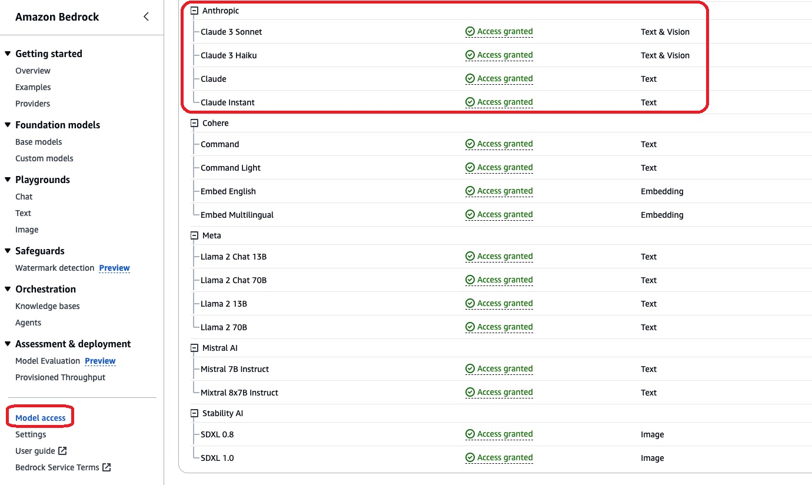
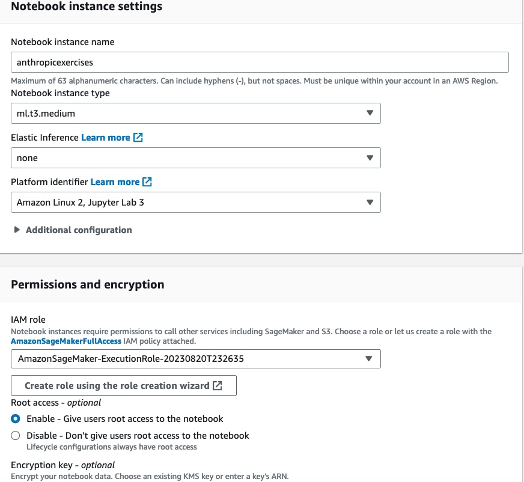
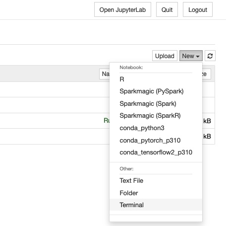

# Amazon Bedrock-Examples Exercises

## Prerequisites

### Overview

These exercises must be executed in your own account with access to Amazon Bedrock. Please ensure the following:

- You can run these exercises in the `us-east-1` (N. Virginia) or `us-west-2` (Oregon) regions.
- If you are running these exercises on SageMaker Notebook or Studio, use the following recommended kernel configurations:
  - Image: conda_python3 or Data Science 3.0 (or greater)
  - Instance Type: `ml.t3.medium`

### Envrionment (Setup)

To get started, follow these steps:

1. Access the AWS Console.
2. Navigate to the Amazon Bedrock console.
3. On the left menu, click on "Model Access".
4. On the Model Access screen, click the "Manage Model Access" button in the top-right corner.
5. On the Model Access screen, select only the following models and click the "Request Model Access" button:
   - Anthropic
     - Claude 3 Sonnet
     - Claude 3 Haiku
     - Claude
     - Claude Instant
   - Mistral AI
     - Mistral 7B Instruct
     - Mixtral 8x7B Instruct
     - Mistral Large	 


### Repository Download (Code Samples)

Clone the following repository, which includes examples showcased in these exercises:
```
git clone https://github.com/lichen79/bedrock-examples.git
```
IAM Policy for Amazon Bedrock
The following IAM policy is a sample that should be created to grant access to Bedrock APIs:
```
{
    "Version": "2012-10-17",
    "Statement": [
        {
            "Sid": "Statement1",
            "Effect": "Allow",
            "Action": "bedrock:*",
            "Resource": "*"
        }
    ]
}
```
## Installation (optional: detailed guide on AWS Sagemaker Jupyter notebook)

### Start your first AWS SageMaker Notebook

#### Sign in to the AWS Management Console

1. Go to the AWS Management Console (https://console.aws.amazon.com/) and sign in with your AWS account credentials.
	- `us-east-1` (N. Virginia) or `us-west-2` (Oregon) regions
#### Navigate to the SageMaker Service

2. In the AWS Management Console, use the search bar at the top to find the "SageMaker" service, or navigate to it through the "Services" dropdown menu.

#### Create a New Notebook Instance

3. In the SageMaker console, click on "Notebook instances" in the left-hand navigation pane.
4. Click on the "Create notebook instance" button.
5. On the "Create notebook instance" page, you'll need to configure the following:
   - **Notebook instance name**: Give your notebook instance a descriptive name, like "anthropicexercises".
   - **Notebook instance type**: Choose an instance type based on your workload requirements (e.g ml.t3.medium for starting out).
   - **IAM role**: Choose an existing IAM role or create a new one with the "AmazonSageMakerFullAccess" + "AmazonBedrockFullAccess" policy attached.
   - **VPC**: N/A
   - **Lifecycle configuration**: Leave this as "No configuration" for now.
   - **Encryption key**: N/A
6. Click "Create notebook instance" to create your instance.
	
#### Open the Notebook Instance

7. Once your notebook instance is created and its status is "InService", click on the "Open Jupyter" link next to your notebook instance.
8. This will open the Jupyter Notebook environment in a new browser tab.
9. Open a new Notebook Terminal as mentioned below:                
	
10. Go to SageMaker folder:
	```cd SageMaker```
11. ```git clone https://github.com/lichen79/bedrock-examples.git```
12. go back to Jypyter notebook
13. open exercises and choose conda_python3 as kernel
14. start your exercises!


## Usage

Provide instructions on how to use the code samples or run the workshop exercises. You can include examples, code snippets, or screenshots to illustrate the usage.

## Contributing

If you would like to contribute to this project, please follow these guidelines:

1. Fork the repository.
2. Create a new branch for your feature or bug fix.
3. Make your changes and commit them with descriptive commit messages.
4. Push your changes to your forked repository.
5. Submit a pull request to the main repository.

## Contributing
MIT License